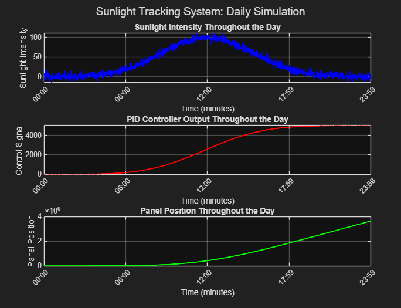

# 🌞 Sunlight Tracking System: Daily Simulation

This project simulates a **Sunlight Tracking System** using a **PID controller** in MATLAB.  
The system models how a solar panel adjusts its position based on sunlight intensity throughout the day.

---

## 🚀 Features
- **PID Controller** implementation (Proportional–Integral–Derivative).
- Simulates a **24-hour sunlight cycle** with Gaussian distribution + noise.
- Tracks:
  - Sunlight Intensity
  - PID Controller Output
  - Panel Position
- Produces **enhanced plots** for clear visualization.

---

## 📊 Example Output

The simulation generates three subplots:
1. **Sunlight Intensity Throughout the Day**  
2. **PID Controller Output Throughout the Day**  
3. **Panel Position Throughout the Day**

---

## 🛠 Tech Stack
- **MATLAB** (R2021a or later recommended)
- Core concepts: PID Control, Gaussian Simulation, Data Visualization

---

